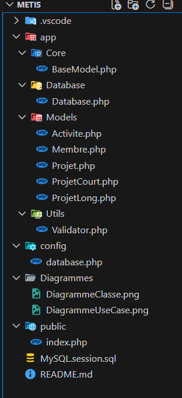

# Projet METIS – Gestion de membres, projets et activités

## Contexte du projet
Ce projet est une application back-end en PHP, destinée à gérer une organisation ou une association. L'application est basée sur la console (CLI) et permet de gérer les membres, les projets et les activités associées.  

L’objectif pédagogique principal est de maîtriser la **programmation orientée objet (POO)** en PHP, le CRUD sécurisé via **PDO**, la logique métier et la modélisation UML.

---

## Arborescence du projet



---

## Objectifs pédagogiques
- Maîtriser la **POO en PHP** : classes, objets, héritage, polymorphisme, encapsulation.
- Concevoir une **architecture claire et maintenable**.
- Manipuler une **base de données relationnelle via PDO**.
- Implémenter un **CRUD complet et sécurisé**.
- Gérer la **logique métier** associée aux membres, projets et activités.
- Respecter les **normes professionnelles** (PSR, séparation des responsabilités).

---

## Entités métier
1. **Membre** : nom, prénom, email, date d’inscription.
2. **Projet** (classe abstraite) :
   - ProjetCourt
   - ProjetLong
3. **Activité** : titre, date, statut, associé à un projet.

---

## Fonctionnalités (CRUD)
### Gestion des membres
- Ajouter, modifier, supprimer un membre.
- Consulter tous les membres ou un membre par ID.
- Vérification de l’unicité de l’email.

### Gestion des projets
- Ajouter un projet (court ou long) pour un membre existant.
- Consulter tous les projets ou les projets d’un membre.
- Supprimer un projet seulement s’il n’a aucune activité.

### Gestion des activités
- Ajouter, modifier ou supprimer une activité pour un projet.
- Consulter l’historique des activités d’un projet.
- Transactions PDO pour sécuriser les opérations.

---

## User Stories
**Membres**
- US01 : Créer un membre.
- US02 : Consulter la liste des membres.
- US03 : Consulter un membre par ID.
- US04 : Modifier un membre.
- US05 : Supprimer un membre si aucun projet associé.

**Projets**
- US06 : Créer un projet pour un membre existant.
- US07 : Choisir le type de projet (court ou long).
- US08 : Consulter tous les projets.
- US09 : Consulter les projets d’un membre.
- US10 : Supprimer un projet uniquement s’il n’a aucune activité.

**Activités**
- US11 : Ajouter une activité à un projet.
- US12 : Modifier ou supprimer une activité.
- US13 : Consulter l’historique des activités.

---

## Contraintes techniques
- Programmation orientée objet (POO)
- Encapsulation : `private`, `protected` + getters/setters
- Héritage et polymorphisme
- Classe abstraite : `Projet`
- CRUD via **PDO** avec requêtes préparées
- Transactions PDO sécurisées pour les activités
- Respect des **normes PSR-4 et PSR-12**
- Modélisation UML : diagramme de classes + diagramme de cas d’utilisation

---

## Installation
1. Cloner le projet :
```bash
git clone <https://github.com/abdelhakimallouani/Metis.git>
